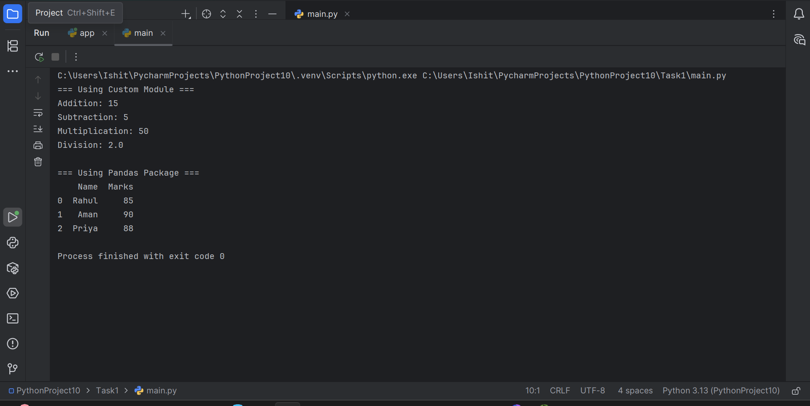
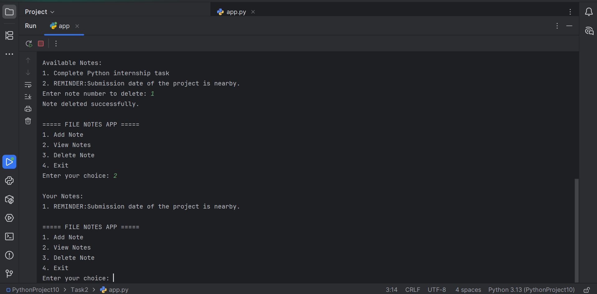
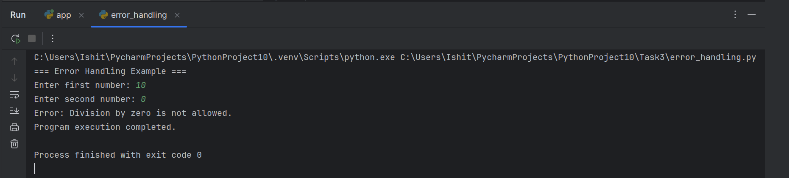
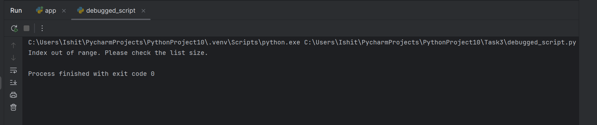

# Python Internship – Week 4

This repository contains all Week 4 internship tasks completed during the Python Development Internship.

---

## Task 1 – Modules and Packages

* Created a custom Python module
* Imported and used module functions
* Demonstrated usage of Pandas package

---

## Task 2 – Mini Project

Project: File-Based Notes Application

Features:

* Add Notes
* View Notes
* Delete Notes
* Store Notes in Text File

---

## Task 3 – Error Handling and Debugging

* Implemented try-except-finally blocks
* Handled common runtime errors
* Debugged a Python script and resolved IndexError

---

## Technologies Used

* Python
* Pandas
* NumPy
* File Handling
* Exception Handling

---

## Author

Python Development Internship – Week 4 Submission
